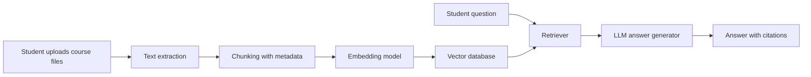

# CourseMate AI

CourseMate AI is an AI study assistant that answers questions from course materials with citations. Students upload lecture slides, assignment specs, past exams, and subtitle files; the system retrieves relevant passages, generates answers, creates revision notes, and produces practice questions with page-level or section-level evidence.

## Why this project

This is a portfolio-oriented RAG project with a clear real-world use case. It shows practical skills in full-stack development, document processing, embeddings, vector search, LLM orchestration, evaluation, and product thinking.

## Core Features

- Upload course files: PDF slides, assignment specs, past exams, text notes, and subtitles.
- Ask course-specific questions and receive grounded answers.
- Show citations for every answer, including source file and page or section.
- Generate revision notes from selected materials.
- Generate multiple-choice and true/false questions.
- Track answer quality using a small evaluation set.

## MVP Scope

The first version should focus on one course and a small set of documents.

1. User uploads PDF or TXT course materials.
2. Backend extracts text and chunks it with metadata.
3. Embeddings are stored in a vector database.
4. User asks a question in the web app.
5. System retrieves relevant chunks and asks the LLM to answer with citations.
6. UI displays answer, cited sources, and retrieved snippets.

## Suggested Tech Stack

- Frontend: Next.js, TypeScript, Tailwind CSS
- Backend: FastAPI or Next.js API routes
- Database: PostgreSQL
- Vector search: pgvector, Chroma, or Qdrant
- Document parsing: PyMuPDF, pdfplumber, or unstructured
- LLM: OpenAI API or another compatible model provider
- Evaluation: custom golden Q&A set plus retrieval hit-rate checks

## Two-Person Split

Person A can focus on product and frontend:

- Upload page
- Course document library
- Q&A chat interface
- Citation display
- Revision notes and quiz UI

Person B can focus on backend and AI pipeline:

- File parsing
- Chunking and metadata
- Embeddings and vector search
- RAG prompt design
- Evaluation scripts
- API design

Both people should review each other's work through pull requests.

## Milestones

### Week 1: Project Setup

- Finalize stack
- Create GitHub repository
- Set up frontend and backend skeleton
- Add basic README, roadmap, and issues

### Week 2: Upload and Parsing

- Support PDF and TXT upload
- Extract text with page metadata
- Store documents and chunks

### Week 3: Retrieval

- Generate embeddings
- Store vectors
- Retrieve top relevant chunks for a query

### Week 4: Q&A with Citations

- Build RAG answer endpoint
- Enforce citation format
- Display answer and sources in the UI

### Week 5: Study Tools

- Generate revision notes
- Generate MCQ and true/false questions
- Save generated study sets

### Week 6: Evaluation and Demo

- Create a small benchmark dataset
- Measure retrieval quality and answer faithfulness
- Record demo video
- Polish README with screenshots and architecture diagram

## Evaluation Ideas

- Retrieval hit rate: whether the correct document chunk appears in top-k results.
- Citation accuracy: whether cited snippets actually support the answer.
- Answer faithfulness: whether the model avoids unsupported claims.
- Latency: upload processing time and average Q&A response time.

## Architecture



## Repository Structure

```text
coursemate-ai/
  apps/
    web/
  services/
    api/
  packages/
    shared/
  docs/
    architecture.md
    roadmap.md
  evals/
  README.md
```

## Resume Talking Points

- Built an end-to-end Retrieval-Augmented Generation application for course-specific study assistance.
- Implemented document parsing, chunking, embeddings, vector retrieval, and citation-grounded answer generation.
- Designed evaluation metrics for retrieval quality and answer faithfulness.
- Collaborated through GitHub issues, pull requests, and milestone planning.

