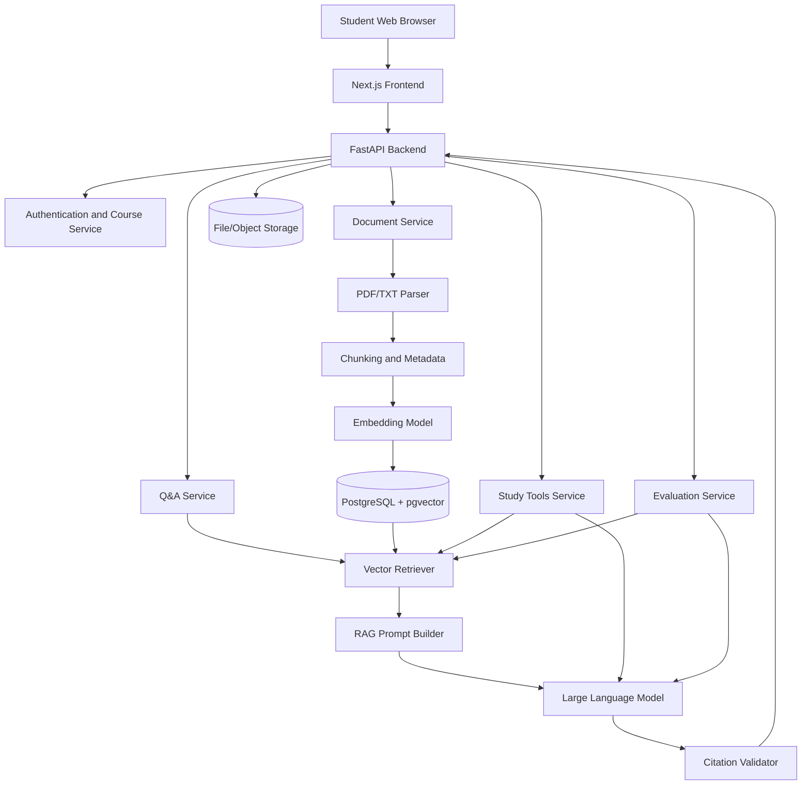

# CourseMate AI 项目方案

## 1. Project Overview 项目概述

CourseMate AI 是一个基于课程资料的智能学习助手。学生可以上传 lecture slides、assignment specifications、past exams、notes 和 subtitle files，系统通过 Retrieval-Augmented Generation（RAG）检索与问题最相关的课程内容，再由大语言模型生成带有文件名、页码或章节引用的回答。

项目不仅提供课程问答，还可以生成复习笔记、选择题、判断题和知识点总结。系统的核心目标不是成为一个通用聊天机器人，而是成为一个能够基于指定课程资料进行回答、展示证据来源并减少错误信息的学习工具。

该项目适合作为两人合作的 portfolio project，也可以进一步发展为 HCI、Information Systems、Educational Technology 或 Trustworthy AI 方向的研究原型。

### Project Objectives 项目目的

1. 构建完整的 RAG 应用，展示前端、后端、数据库、LLM 和向量检索能力。
2. 帮助学生更快理解课程内容、定位资料和准备考试。
3. 通过引用和证据展示减少 AI hallucination，提高回答可信度。
4. 研究不同文档处理、检索和提示方法对回答质量的影响。
5. 为求职准备一个可以演示、测试、部署和写入简历的完整项目。
6. 为博士申请准备一个可扩展为研究项目的原型和评估数据。

---

## 2. Problem Statement 问题描述

大学课程资料通常分散在 lecture slides、assignment documents、reading materials、past exams、recording subtitles 和个人笔记中。学生在复习或完成作业时，需要花费大量时间在不同文件中搜索信息。

通用大语言模型虽然可以回答问题，但通常无法直接访问学生的课程资料，也可能生成没有依据的内容。即使回答看起来合理，学生也很难判断答案是否来自课程内容、是否准确，以及应该查看原文件的哪一页。

因此，本项目需要解决以下问题：

- 如何从多种课程文件中快速找到与问题相关的内容。
- 如何让 AI 的回答严格基于上传资料，而不是自由猜测。
- 如何为每个回答提供清晰、可验证的引用。
- 如何把课程资料转化为复习笔记和练习题。
- 如何评估检索结果、引用和生成答案的质量。

---

## 3. Target Users 目标用户

### Primary Users 主要用户

- 大学生和研究生
- 国际学生
- 需要准备考试或完成课程作业的学生
- 需要快速查找课程资料的学生

### Secondary Users 次要用户

- Tutor 和 teaching assistant
- Course coordinator
- 希望建立课程知识库的教师
- 研究 AI-assisted learning 的研究人员

### Initial User Group 初始用户群体

MVP 阶段建议只面向一门课程、少量用户和有限数量的资料。这样可以控制系统复杂度，也更容易建立标准问题集进行测试。

---

## 4. User Requirements 用户需求

用户需要能够：

1. 创建或选择一门课程。
2. 上传 PDF、TXT 或字幕文件。
3. 查看已经上传的课程资料。
4. 输入自然语言问题。
5. 获得基于课程资料的回答。
6. 查看回答对应的文件名、页码、章节和原文片段。
7. 点击引用并快速定位到来源内容。
8. 根据指定文件生成复习笔记。
9. 生成选择题和判断题。
10. 查看练习题答案和解释。
11. 删除错误或过期的课程文件。
12. 在合理时间内获得结果。
13. 清楚知道系统无法从资料中找到答案的情况。
14. 确保上传的课程资料不会被其他用户随意访问。

---

## 5. Functional Requirements 功能需求

### FR-01 User and Course Management

- 用户可以创建、查看和选择课程。
- 系统将文件、聊天记录和学习资料与具体课程关联。

### FR-02 Document Upload

- 支持 PDF、TXT 和常见字幕格式。
- 检查文件类型、文件大小和上传状态。
- 显示文件处理进度和错误信息。

### FR-03 Document Processing

- 提取上传文件中的文本。
- 保留文件名、页码、章节和课程 ID 等 metadata。
- 将长文本划分为适合检索的 chunks。
- 为 chunks 生成 embeddings。
- 将文本、metadata 和 vectors 存入数据库。

### FR-04 Course Q&A

- 用户可以针对当前课程提出问题。
- 系统从该课程资料中检索 top-k relevant chunks。
- LLM 根据检索结果生成回答。
- 当资料不足时，系统明确说明无法确认答案。

### FR-05 Citation and Evidence

- 每个主要回答显示引用来源。
- 引用至少包含文件名和页码或章节。
- 用户可以查看支持答案的原文片段。
- 系统避免展示与答案无关的引用。

### FR-06 Revision Notes

- 用户可以选择一份或多份资料生成复习笔记。
- 笔记可以按主题、章节或知识点组织。
- 生成内容保留资料引用。

### FR-07 Quiz Generation

- 生成 multiple-choice questions。
- 生成 true/false questions。
- 提供正确答案、解释和来源。
- 用户可以选择题目数量和难度。

### FR-08 History and Saved Content

- 保存最近的问题和回答。
- 保存生成的复习笔记和题目集。
- 允许用户重新打开或删除已保存内容。

### FR-09 Evaluation Module

- 保存测试问题、标准答案和标准引用。
- 自动运行 retrieval evaluation。
- 记录回答延迟、citation accuracy 和 faithfulness。

### FR-10 Administration

- 查看文件处理状态。
- 查看失败任务和系统日志。
- 管理测试数据和模型配置。

---

## 6. Non-functional Requirements 非功能需求

### Performance 性能

- 普通问题的目标响应时间控制在 5 至 10 秒内。
- 文件处理在后台异步进行。
- MVP 支持数十个课程文件和数千个 text chunks。

### Reliability 可靠性

- 文件处理失败时提供明确错误提示。
- 单个文件错误不应导致整个服务停止。
- 重要数据进行持久化存储。

### Security 安全性

- 验证上传文件类型和大小。
- 防止恶意文件和路径注入。
- API keys 保存在环境变量中。
- 用户文件不应公开暴露。
- 密码、token 和 API key 不得提交到 GitHub。

### Privacy 隐私

- 用户只能访问自己的课程资料。
- 清楚说明上传资料如何存储和处理。
- 提供删除课程资料的功能。
- 正式部署时避免使用未经授权的版权资料作为公共数据。

### Usability 易用性

- 界面简单、清晰，并提供上传和处理状态反馈。
- 引用容易阅读和点击。
- 对国际学生使用简单英语和明确标签。

### Accessibility 可访问性

- 支持键盘操作。
- 保持足够的文字与背景对比度。
- 不只依靠颜色传递状态。
- 图标和交互组件提供文本说明。

### Maintainability 可维护性

- 前端、后端、AI pipeline 和 evaluation 模块分离。
- 关键函数包含测试。
- 使用统一代码格式、类型检查和 pull request review。

### Scalability 可扩展性

- MVP 先支持一门课程。
- 后续扩展到多课程、多用户和更多文件格式。
- LLM、embedding model 和 vector database 可替换。

---

## 7. System Scope 项目范围

### In Scope for MVP

- 单用户或简单登录
- 单门课程
- PDF 和 TXT 文件上传
- 文本提取和 page-level metadata
- 文本 chunking
- Embedding generation
- Vector search
- 基于 RAG 的课程问答
- 文件名和页码引用
- 引用原文片段展示
- 基础复习笔记生成
- 基础选择题和判断题生成
- 小型 evaluation dataset
- 本地运行或基础云端部署

### Out of Scope for MVP

- 大规模学校级部署
- 实时多人协作
- 自动连接 Canvas 或其他 LMS
- 视频和音频直接处理
- 复杂 OCR 和手写识别
- 自动评分正式作业
- 代写完整 assignment
- 多智能体工作流
- 个性化长期学习路径
- 移动端原生应用

### Future Scope

- OCR 扫描文件处理
- Lecture audio transcription
- Canvas 或 Moodle integration
- Knowledge graph
- Hybrid search
- Reranker
- 多模态图片和图表问答
- 个性化学习进度
- Spaced repetition
- Teacher dashboard
- Local LLM 或 privacy-preserving deployment

---

## 8. Technology Stack 技术栈

### Frontend

- Next.js
- TypeScript
- Tailwind CSS
- React Query 或 SWR
- PDF.js

### Backend

- FastAPI
- Python
- Pydantic
- SQLAlchemy
- BackgroundTasks、Celery 或 RQ

### Database and Vector Search

- PostgreSQL
- pgvector

MVP 建议优先使用 PostgreSQL + pgvector，因为 relational data 和 vector data 可以放在同一个数据库中，能减少部署复杂度。

### Document Processing

- PyMuPDF
- pdfplumber 作为补充
- Python subtitle parser

### AI and RAG

- OpenAI API 或其他兼容 LLM
- OpenAI embedding model 或 sentence-transformers
- LangChain 或 LlamaIndex 可选

建议先自行实现基础 RAG pipeline，再按需要引入框架。这样更容易理解系统流程，也更适合面试展示。

### Testing and Evaluation

- Pytest
- Playwright
- Ragas 可选
- 自定义 golden Q&A dataset

### DevOps

- GitHub
- GitHub Actions
- Docker
- Docker Compose
- Vercel
- Render、Railway 或 Fly.io
- Supabase、Neon 或 managed PostgreSQL

---

## 9. System Architecture 系统架构

### Main Workflow

1. 用户上传课程文件。
2. 后端验证文件并保存原文件。
3. Parser 提取每一页或章节的文字。
4. Chunking module 划分文本并附加 metadata。
5. Embedding model 将 chunks 转换为 vectors。
6. 数据存入 PostgreSQL 和 pgvector。
7. 用户提出问题。
8. Retriever 找到 top-k relevant chunks。
9. Prompt builder 将问题和检索内容发送给 LLM。
10. Citation validator 检查引用是否存在并与来源对应。
11. 前端显示回答、引用和原文片段。

---

## 10. Team Responsibilities 两人分工

### Person A: Product, UX and Frontend

- User research and user stories
- Figma wireframes
- Next.js frontend
- Upload interface
- Course document library
- Chat interface
- Citation cards and PDF navigation
- Revision notes and quiz UI
- Accessibility and usability testing
- Demo video and product documentation

### Person B: Backend, AI and Data

- FastAPI backend
- Database design
- File parsing
- Chunking and metadata
- Embedding pipeline
- Vector retrieval
- RAG prompt design
- Citation generation and validation
- Evaluation scripts
- Deployment configuration

### Shared Responsibilities

- Architecture decisions
- GitHub issues and project board
- Pull request reviews
- Test dataset creation
- End-to-end integration
- Evaluation report
- Final presentation and README

---

## 11. Timeline 时间计划

### Week 1: Planning and Setup

- 确定 MVP scope
- 建立 user stories 和 acceptance criteria
- 完成 Figma wireframe
- 建立 frontend、backend 和 database skeleton
- 配置 GitHub issues、branches 和 CI

### Week 2: Upload and Document Processing

- 完成 PDF/TXT upload
- 完成文件验证和存储
- 提取文本和 page metadata
- 建立 document 和 chunk database tables

### Week 3: Embeddings and Retrieval

- 实现 chunking strategy
- 生成 embeddings
- 配置 pgvector
- 实现 top-k similarity search
- 建立基本 retrieval tests

### Week 4: RAG Q&A and Citations

- 建立 Q&A API
- 完成 prompt template
- 生成结构化引用
- 在前端显示 answer、source 和 snippet
- 处理 cannot-answer cases

### Week 5: Study Tools and UX Improvement

- 复习笔记生成
- MCQ 和 true/false question generation
- 保存内容
- 改进 loading、error 和 empty states
- 完成 accessibility review

### Week 6: Evaluation, Deployment and Demo

- 建立 30 至 50 个 golden questions
- 运行 retrieval 和 answer evaluation
- 完成用户测试
- 修复关键问题
- 部署系统
- 完成 README、architecture diagram、screenshots 和 demo video

### Optional Weeks 7–8: Research Extension

- 比较不同 chunk sizes
- 比较 vector search 与 hybrid search
- 加入 reranker
- 测试不同 prompt strategies
- 分析用户信任、引用使用和学习效果
- 撰写 technical report 或 research-style paper

---

## 12. Evaluation Plan 评估方式

### 12.1 Technical Evaluation

建立一个包含 30 至 50 个问题的 golden dataset。每个问题包括：

- Question
- Expected answer
- Correct source document
- Correct page or section
- Expected relevant chunk
- Difficulty level

#### Retrieval Metrics

- Hit Rate@K
- Recall@K
- Mean Reciprocal Rank（MRR）
- Precision@K

#### Answer Metrics

- Answer correctness
- Faithfulness
- Relevance
- Completeness
- Cannot-answer accuracy

#### Citation Metrics

- Citation precision
- Citation recall
- Citation correctness
- Citation completeness

#### System Metrics

- Upload processing time
- Average response latency
- Error rate
- Token usage
- Cost per question

### 12.2 User Evaluation

邀请 5 至 10 名学生完成一组学习任务：

1. 从课程资料中找到某个概念。
2. 询问 assignment requirement。
3. 根据一章内容生成复习笔记。
4. 完成系统生成的练习题。
5. 检查答案引用是否可信。

收集：

- Task completion rate
- Time on task
- System Usability Scale（SUS）
- Perceived usefulness
- Perceived ease of use
- Trust in answers
- Trust in citations
- Willingness to use

### 12.3 Experimental Evaluation

可以比较：

- No RAG vs RAG
- Vector search vs hybrid search
- Small chunks vs large chunks
- Without reranker vs with reranker
- Answer without citations vs answer with citations

可研究的问题：

- 引用是否提高用户对 AI 答案的信任？
- 引用是否帮助学生更快核实答案？
- 不同 chunking strategies 如何影响检索准确率？
- 学生是否会过度依赖 AI 生成内容？

---

## 13. Risks and Limitations 风险与限制

### Hallucination

即使使用 RAG，LLM 仍可能生成资料中不存在的内容。

Mitigation:

- 限制模型只能根据 context 回答。
- 对不足证据返回 cannot answer。
- 验证引用和来源。
- 在 UI 中提醒用户核实原文。

### Poor Retrieval

正确内容可能没有进入 top-k results，导致答案不完整或错误。

Mitigation:

- 测试不同 chunk sizes 和 overlap。
- 使用 metadata filtering。
- 后续加入 hybrid search 和 reranker。

### PDF Parsing Problems

扫描文件、复杂表格、双栏排版和图片内容可能无法正确提取。

Mitigation:

- MVP 优先使用 text-based PDFs。
- 显示 extraction preview。
- 后续加入 OCR 和 layout-aware parsing。

### Citation Errors

模型可能生成错误页码，或引用无法支持答案。

Mitigation:

- 不让模型自由编写 citation ID。
- 使用系统分配的 chunk IDs。
- 后端将 chunk IDs 转换成真实文件名和页码。
- 对 citation support 进行自动和人工检查。

### Privacy and Copyright

课程资料可能受版权保护，也可能包含私人信息。

Mitigation:

- 不公开分享用户上传资料。
- 使用访问控制。
- 提供删除功能。
- Demo 使用自有资料、公开资料或获得许可的资料。

### Cost

LLM 和 embedding API 会产生费用。

Mitigation:

- 缓存 embeddings 和重复回答。
- 限制文件大小和 query frequency。
- 使用较小模型完成简单任务。
- 记录 token usage 和 cost。

### Limited Evaluation Dataset

小型项目的测试问题数量有限，结果可能无法代表所有课程和学科。

Mitigation:

- 明确报告样本大小。
- 使用不同类型和难度的问题。
- 后续扩展到更多课程。

### Academic Integrity

系统可能被用于直接生成作业答案。

Mitigation:

- 产品定位为 study support，而不是 assignment writing tool。
- 对 assessment questions 提供概念解释和来源，而不是直接代写。
- 加入 academic integrity notice。

### Team and Schedule Risk

两人可能因为技术难度、时间安排或 API 问题延迟项目。

Mitigation:

- 严格控制 MVP scope。
- 每周设置 milestone。
- 每个功能都有 acceptance criteria。
- 优先完成 end-to-end basic flow，再增加高级功能。

---

## 14. Expected Deliverables 最终成果

- 可运行的 web application
- GitHub repository
- README and setup instructions
- System architecture diagram
- Database schema
- API documentation
- Evaluation dataset
- Evaluation results
- Screenshots and demo video
- User testing report
- Technical report 或 research-style report
- Resume bullet points

---

## 15. Success Criteria 成功标准

MVP 可以被认为成功，当它满足以下条件：

1. 用户能够成功上传并处理至少 5 至 10 个课程文件。
2. 系统能够回答课程相关问题并显示可验证引用。
3. 在测试集上，正确来源进入 top-5 retrieval results 的比例达到可接受水平。
4. 大部分回答不包含明显 unsupported claims。
5. 用户可以生成并查看复习笔记和练习题。
6. 系统可以通过公开 demo 或本地安装稳定演示。
7. GitHub 中包含清晰的代码结构、issues、pull requests、tests 和 documentation。
8. 项目报告能够解释设计选择、实验方法、结果和限制。
